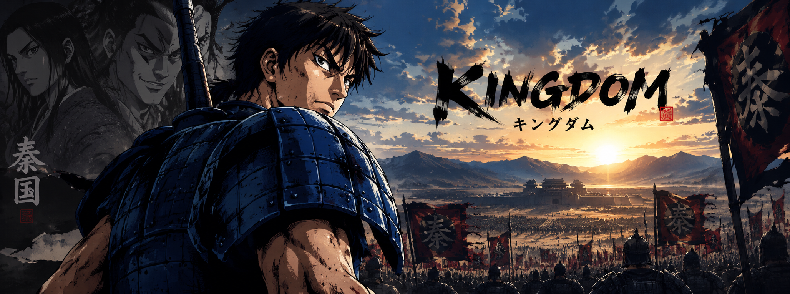

  

<h1 align="center">backmirio</h1>

  Game Developer

<h2>Technologies</h2>

  
  
  
  

<h2>About</h2>

  Game Dev Junior interested in game development, programming and creating projects.

<h2>Projects</h2>

  Currently working on personal projects with Python, PHP, MySQL and Godot.

