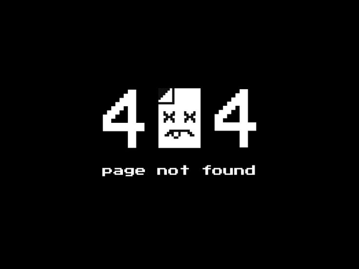

  

---

<h2>About Me</h2>

  I'm a Junior Game Developer with a strong interest in software development,
  game development and automation. I enjoy turning ideas into functional projects
  and writing tools that solve real-world problems.

---

<h2>Languages & Technologies</h2>

  
  
  
  
  
  
  
  

---

<h2>Current Focus</h2>

<ul>
  <li>Game development with Godot</li>
  <li>Building applications and web projects</li>
  <li>Developing scripts and automation tools</li>
  <li>Improving my programming and software development skills</li>
</ul>

---

<h2>Projects</h2>

  I'm currently working on personal projects focused on game development,
  software development, web technologies and automation.

---

<h2>GitHub</h2>

  This profile contains my personal projects, experiments and ongoing work.

